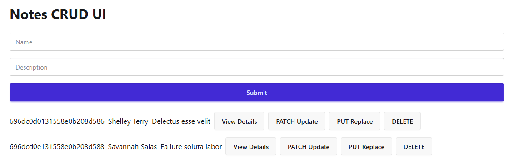

<h1 align="center">Axios Notes</h1>

- [Introduction:](#introduction)
    - [Why Axios instead of fetch:](#why-axios-instead-of-fetch)
    - [Installing Axios:](#installing-axios)
- [Examples:](#examples)
    - [Example 1:](#example-1)


# Introduction: 
Axios is a promise-based HTTP client for node.js used to communicate with servers (APIs). We can use it all HTTP methods like (GET, POST, PUT, PATCH, DELETE) and for Handle headers, auth, errors, interceptors, etc.

### Why Axios instead of fetch: 

| Feature                                     | Axios | fetch |
| ------------------------------------------- | ----- | ----- |
| Automatic JSON parsing (most used features) | ✅     | ❌     |
| Interceptors                                | ✅     | ❌     |
| Request timeout                             | ✅     | ❌     |
| Better error handling                       | ✅     | ❌     |
| Old browser support                         | ✅     | ❌     |

### Installing Axios:

```Bash
npm install axios
```

Note: CommonJS usage
In order to gain the TypeScript typings (for intellisense / autocomplete) while using CommonJS imports with require() use the following approach:

```js
const axios = require('axios').default;

// axios.<method> will now provide autocomplete and parameter typings
```

# Examples: 

### Example 1:  

- client: 

```js
import React, { useEffect, useState } from 'react';
import toast from 'react-hot-toast';
import axios from 'axios';

const App = () => {

  const [notes, setNotes] = useState([])
  const [singleNotes, setSingleNotes] = useState(null) // or useState({})
  const [id, setId] = useState()

  // send data to db
  const handleSubmit = (e) => {
    e.preventDefault();
    const name = e.target.name.value
    const description = e.target.description.value
    const singleNoteObj = { name, description }

    axios.post('http://localhost:3000/notes', singleNoteObj)
      .then(res => {
        if (res.data.insertedId) {
          toast.success("Note Added")
          e.target.reset()
          console.log(res.data)
          singleNoteObj._id = res.data.insertedId
          setNotes([...notes, singleNoteObj])
        }
      });
  }


  // get all data form db
  useEffect(() => {
    axios.get('http://localhost:3000/notes')
      .then(res => setNotes(res.data))
  }, [])


  // get single data form db
  useEffect(() => {
    if (!id) return;
    axios.get(`http://localhost:3000/notes/${id}`)
      .then(res => setSingleNotes(res.data))
  }, [id])


  // update selected object partial data
  const handlePatchUpdate = (e) => {
    e.preventDefault();
    const name = e.target.name.value
    const description = e.target.description.value
    const patchObj = { name, description }

    axios.patch(`http://localhost:3000/notes/${id}`, patchObj)
      .then(res => {
        if (res.data.modifiedCount) {
          toast.success("Note Updated(PATCH)")
          console.log(res.data)

          const updatedNotes = notes.map((note) => note._id === id ? { ...note, ...patchObj } : note)

          setNotes(updatedNotes)

          setSingleNotes(prev => ({ ...prev, ...patchObj }));
        }
      })
  }

  // replace selected object full data
  const handlePutUpdate = (e) => {
    e.preventDefault();
    const name = e.target.name.value
    const description = e.target.description.value
    const putObj = { name, description }

    axios.put(`http://localhost:3000/notes/${id}`, putObj)
      .then(res => {
        if (res.data.modifiedCount) {
          toast.success("Note Updated(PUT)")
          console.log(res.data)

          const updatedNotes = notes.map((note) => note._id === id ? { ...note, ...putObj } : note)

          setNotes(updatedNotes)

          setSingleNotes({ _id: id, ...putObj });
        }
      })
  }

  // delete data form db
  const handleDelete = (id) => {
    axios.delete(`http://localhost:3000/notes/${id}`)
      .then(res => {
        if (res.data.deletedCount) {
          console.log(res.data)
          toast.success("Note Deleted")

          const remainingNotes = notes.filter((note) => note._id !== id)
          setNotes(remainingNotes)
        }
      })
  }
  return (
    <div className="p-8 max-w-6xl mx-auto">
      <h1 className="text-3xl font-bold mb-6">Notes CRUD UI</h1>

      {/* Form */}
      <form onSubmit={handleSubmit} className="mb-6 space-y-4">
        <input type="text" name="name" placeholder="Name" className="input w-full" />
        <input type="text" name="description" placeholder="Description" className="input w-full" />
        <input type="submit" value="Submit" className='btn w-full btn-primary' />
      </form>

      {/* Notes */}
      <div className='space-y-4'>
        {notes?.map((note) => (
          <div key={note._id} className='flex items-center gap-2'>

            <p>{note._id}</p>
            <p>{note.name}</p>
            <p>{note.description}</p>

            <button className="btn" onClick={() => {
              document.getElementById('my_modal_1').showModal()
              setId(note._id)
            }}>View Details</button>

            <button className="btn" onClick={() => {
              document.getElementById('my_modal_2').showModal()
              setId(note._id)
            }}>PATCH Update</button>

            <button className="btn" onClick={() => {
              document.getElementById('my_modal_3').showModal()
              setId(note._id)
            }}>PUT Replace</button>

            <button className="btn" onClick={() => { handleDelete(note._id) }}>DELETE</button>

          </div>
        ))}
      </div>

      {/* view details modal */}
      <dialog id="my_modal_1" className="modal">
        <div className="modal-box">
          <p>id: {singleNotes?._id}</p>
          <p>Name: {singleNotes?.name}</p>
          <p>Name: {singleNotes?.description}</p>
        </div>
        <form method="dialog" className="modal-backdrop">
          <button>close</button>
        </form>
      </dialog>

      {/* patch modal */}
      <dialog id="my_modal_2" className="modal">
        <div className="modal-box">
          <form onSubmit={handlePatchUpdate} className="mb-6 space-y-4">
            <input type="text" name="name" defaultValue={singleNotes?.name} className="input w-full" />
            <input type="text" name="description" defaultValue={singleNotes?.description} className="input w-full" />
            <input type="submit" value="Submit" className='btn w-full btn-primary' />
          </form>
        </div>
        <form method="dialog" className="modal-backdrop">
          <button>close</button>
        </form>
      </dialog>

      {/* put modal */}
      <dialog id="my_modal_3" className="modal">
        <div className="modal-box">
          <form onSubmit={handlePutUpdate} className="mb-6 space-y-4">
            <input type="text" name="name" defaultValue={singleNotes?.name} className="input w-full" />
            <input type="text" name="description" defaultValue={singleNotes?.description} className="input w-full" />
            <input type="submit" value="Submit" className='btn w-full btn-primary' />
          </form>
        </div>
        <form method="dialog" className="modal-backdrop">
          <button>close</button>
        </form>
      </dialog>

    </div>
  );
}

export default App;
```



- server: 
  
```js
const express = require('express')
const cors = require('cors')
require('dotenv').config()
const { MongoClient, ServerApiVersion, ObjectId } = require('mongodb');

const port = process.env.PORT || 3000

const app = express()
app.use(cors()) // use cors middleware
app.use(express.json()) // use express middleware


const client = new MongoClient(process.env.MONGODB_URI, {
    serverApi: {
        version: ServerApiVersion.v1,
        strict: true,
        deprecationErrors: true,
    }
});

async function run() {
    await client.connect();

    const notesCollection = client.db("notesDB").collection('notes')


    // POST - create new note
    app.post('/notes', async (req, res) => {
        const note = req.body;
        const result = await notesCollection.insertOne(note);
        res.send(result);
    });


    // GET all notes
    app.get('/notes', async (req, res) => {
        const notes = await notesCollection.find({}).toArray();
        res.send(notes);
    });

    // GET a single note
    app.get('/notes/:id', async (req, res) => {
        const id = req.params.id
        const filter = { _id: new ObjectId(id) }
        const result = await notesCollection.findOne(filter);
        res.send(result);
    });


    // PATCH - partial update
    app.patch('/notes/:id', async (req, res) => {
        const id = req.params.id
        const filter = { _id: new ObjectId(id) }
        const updatedData = req.body;
        const updatedDoc = {
            $set: {
                name: updatedData.name,
                description: updatedData.description
            }
        }

        const result = await notesCollection.updateOne(filter, updatedDoc);
        res.send(result);
    });

    // PUT - full replace
    app.put('/notes/:id', async (req, res) => {
        const id = req.params.id
        const filter = { _id: new ObjectId(id) }
        const updatedData = req.body;
        const options = { upsert: true }

        const result = await notesCollection.replaceOne(filter, updatedData, options);
        res.send(result);
    });


    // DELETE
    app.delete('/notes/:id', async (req, res) => {
        const result = await notesCollection.deleteOne({ _id: new ObjectId(req.params.id) });
        res.send(result);
    });

    // Send a ping to confirm a successful connection
    await client.db("admin").command({ ping: 1 });
    console.log("Pinged your deployment. You successfully connected to MongoDB!");
}
run().catch(console.dir);


app.get('/', (req, res) => {
    res.send('Hello World!')
})

app.listen(port, () => {
    console.log(`Example app listening on port ${port}`)
})
```

